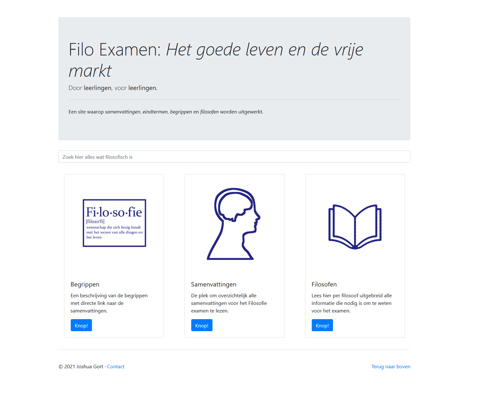

# Filosofie Examen 2021 Site: Het goede leven en de vrije markt
 Copyright (c) 2021 Joshua Gort

A site where summaries, endterms, definitions and philosophers are written out for the dutch philosophy exam 2021/2022.

It is currently based on a ruby on rails application using the bootstrap 4 framework.

* Rails version: 6.1 with Ruby 3.0
